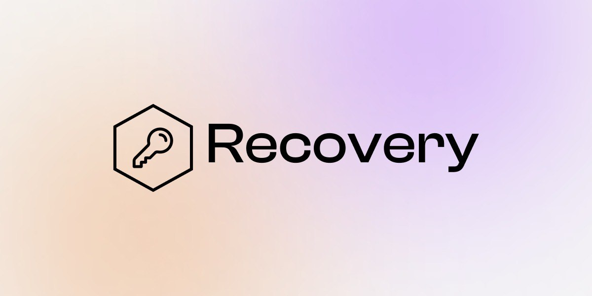
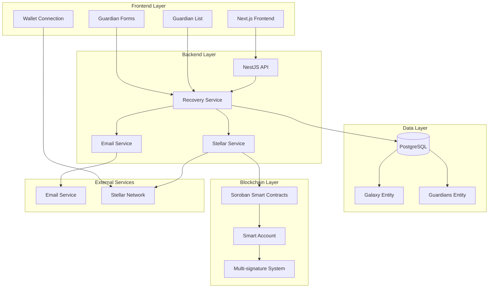

# Recovery - Guardian Wallet Recovery System


A comprehensive wallet recovery system that provides a second layer of security for your digital assets using a guardian-based approach.

## 🛡️ Overview

Recovery is a decentralized wallet recovery service that allows any wallet holder to add a robust security layer to their wallets. By leveraging a network of trusted guardians, users can recover their wallets even if they lose their private keys, ensuring no funds are ever permanently lost due to cryptographic failures.

### Key Benefits
- **No more lost funds** due to private key loss
- **Heritage preservation** - ensure your digital assets can be recovered by trusted contacts
- **Decentralized security** - no single point of failure
- **Flexible threshold system** - customize how many guardians are required for recovery
- **Multi-signature support** - enhanced security through multiple signatures

## 🏗️ How It Works

The Recovery system operates on a **Guardian Galaxy** model:

1. **Security Group Creation**: Users create a recovery group by specifying:
   - A recovery address that will be added to their wallet
   - A list of trusted guardians (contacts)
   - A threshold for how many guardian signatures are required for recovery

2. **Guardian Management**: Each guardian is assigned:
   - A unique email address for notifications
   - A recovery phrase for authentication
   - A private key for signing recovery requests

3. **Recovery Process**: When recovery is needed:
   - Guardians receive notifications via email
   - They authenticate using their assigned phrases
   - Once the threshold is met, the recovery address is added to the wallet
   - The user can then access their funds through the new recovery mechanism

## 🚀 Features

### Core Functionality
- **Multi-Guardian System**: Add multiple trusted contacts as guardians
- **Threshold Recovery**: Set custom thresholds for recovery authorization
- **Email Notifications**: Automated guardian notification system
- **Wallet Integration**: Seamless integration with Stellar wallets
- **Real-time Updates**: Live status updates during recovery process

### Security Features
- **Encrypted Storage**: All sensitive data is encrypted at rest
- **Multi-signature Support**: Enhanced security through multiple signatures
- **Audit Trail**: Complete transaction history and recovery logs
- **Role-based Access**: Different permission levels for different users

### User Experience
- **Intuitive Dashboard**: Clean, modern interface for managing guardians
- **Mobile Responsive**: Works seamlessly across all devices
- **Real-time Status**: Live updates on recovery progress
- **Easy Setup**: Simple wizard for initial configuration

## 🛠️ Technology Stack

### Backend
- **Framework**: NestJS (Node.js)
- **Database**: PostgreSQL with TypeORM
- **Blockchain**: Stellar SDK
- **Email Service**: Nodemailer
- **Validation**: Class-validator & Class-transformer

### Frontend
- **Framework**: Next.js 15 with React 19
- **Styling**: Tailwind CSS
- **UI Components**: Radix UI
- **State Management**: TanStack Query (React Query)
- **Forms**: React Hook Form with Zod validation
- **Wallet Integration**: Stellar Wallets Kit

### Smart Contracts
- **Platform**: Soroban (Stellar's smart contract platform)
- **Language**: Rust
- **Features**: Multi-signature accounts, plugin architecture, role-based access control

## 📋 Prerequisites

Before you begin, ensure you have the following installed:
- Node.js (v18 or higher)
- npm or yarn
- PostgreSQL (v12 or higher)
- Rust (for smart contract development)
- Git

## 🚀 Quick Start

### 1. Clone the Repository
```bash
git clone https://github.com/Sixela33/recovery.git
cd recovery
```

### 2. Backend Setup
```bash
cd backend
npm install
```

### 3. Environment Configuration
Create a `.env` file in the backend directory:
```env
DB_HOST=localhost
DB_PORT=5432
DB_USERNAME=your_db_username
DB_PASSWORD=your_db_password
DB_NAME=recovery_db
EMAIL_HOST=smtp.gmail.com
EMAIL_PORT=587
EMAIL_USER=your_email@gmail.com
EMAIL_PASS=your_app_password
STELLAR_NETWORK=testnet
```

### 4. Database Setup
```bash
# Start PostgreSQL (using Docker)
docker-compose up -d
```

### 5. Start Backend
```bash
npm run start:dev
```

### 6. Frontend Setup
```bash
cd ../frontend
npm install
npm run dev
```

### 7. Access the Application
Open your browser and navigate to `http://localhost:3000`

## 🏗️ Architecture



### Docker Deployment
```bash
# Build and run with Docker Compose
docker-compose up -d
```

### Production Environment
1. Set up production database
2. Configure environment variables
3. Build frontend: `npm run build`
4. Start backend: `npm run start:prod`

## 🤝 Contributing

1. Fork the repository
2. Create a feature branch: `git checkout -b feature/amazing-feature`
3. Commit your changes: `git commit -m 'Add amazing feature'`
4. Push to the branch: `git push origin feature/amazing-feature`
5. Open a Pull Request

---

**Recovery** - Because your digital assets deserve a second chance. 🛡️
