# Smart Account STRIDE Threat Model

## Description

### What is a Smart Account?

A **Smart Account** is an advanced account implementation built on Stellar's Soroban smart contract platform that provides programmable authorization logic through a custom smart contract. Unlike traditional Stellar accounts that rely solely on Ed25519 signatures and basic multisig thresholds, smart accounts implement Soroban's `CustomAccountInterface` to enable sophisticated, policy-driven authorization rules.

This smart account is an **upgradeable smart contract** that implements both the `SmartAccountInterface` (for account management operations) and Soroban's `CustomAccountInterface` (for transaction authorization). It leverages Stellar's account abstraction framework to decouple authentication logic from application-specific authorization rules, allowing for much more granular control over who can authorize what types of transactions.

The key innovation is moving from Stellar's traditional "signature + threshold" model to a **role-based, policy-driven authorization system** where different signers can have different permission levels and constraints.

### Key Features

#### 🔄 **Fully Authorized Upgradeability**
- Smart contract code can be upgraded through the standard signer permission system
- Upgrades require proper authorization from signers with sufficient permissions
- No special backdoors or admin keys - upgrades follow the same authorization rules as other operations

#### 👥 **Hierarchical Signer Types**

| Signer Type | Permissions & Capabilities |
|---|---|
| **Admin Signers** | • Can authorize any transaction for the wallet • Full control over signer configuration (add, update, revoke signers) • Can authorize contract upgrades • Cannot be revoked (prevents account lockout) |
| **Standard Signers** | • Can authorize most transactions • Cannot modify signer configuration or upgrade the contract • Ideal for day-to-day operations while maintaining security boundaries • Optional policy-based restrictions for controlled access • Perfect for delegating permissions to AI agents, automated systems, or third-party services • Support for granular permissions such as: &nbsp;&nbsp;- Token spending limits &nbsp;&nbsp;- Contract interaction deny-listing &nbsp;&nbsp;- Time-based restrictions &nbsp;&nbsp;- Custom authorization policies • Extensible framework for adding new permission types |

#### 🔐 **Multi-Signature Algorithm Support**

| Signature Algorithm | Features & Capabilities |
|---|---|
| **Ed25519 Signatures** | • Traditional cryptographic signatures • Backward compatible with existing Stellar tooling |
| **Secp256r1 Signatures** | • Enables **Passkey/WebAuthn** authentication flows • Provides better user experience through biometric authentication • Supports hardware security keys and platform authenticators • Eliminates the need for users to manage seed phrases |

This dual signature support allows the smart account to bridge traditional crypto workflows with modern web authentication standards, making it more accessible to mainstream users while maintaining the security guarantees expected in the Stellar ecosystem.

**Extensible Architecture**: The signer implementation follows a strategy pattern, making it easily extensible to support additional cryptographic algorithms. New signature schemes such as Secp256k1 or future cryptographic standards can be integrated without modifying the core authorization logic, ensuring the smart account remains adaptable to evolving security requirements.

### Smart Account Authentication Flow

#### Simplified Authorization Flow

The Smart Account implements a strict security model with the following core principles:

1. **Universal Authorization Requirement**: Every execution context (transaction operation) MUST be authorized by at least one signer with sufficient permissions
2. **Cryptographic Integrity**: All signatures provided MUST be cryptographically valid and verifiable
3. **Hierarchical Permission Model**: Authorization success depends on the signer's role and the operation being performed

**Step-by-Step Authorization Process:**

1. **Signature Validation Phase**
   - Verify all provided signatures are cryptographically correct (Ed25519 or Secp256r1)
   - Confirm all signing keys exist in the smart account's signer registry
   - Reject the entire transaction if any signature is invalid

2. **Authorization Check Phase**
   - For each execution context in the transaction:
     - Iterate through all verified signers until one with sufficient permissions is found
       - **Admin Signers**: Automatically authorized for all operations
       - **Standard Signers**: Authorized for non-admin operations only
       - **Standard Signers with Policies**: Subject to policy evaluation (spending limits, time restrictions, etc.)
   - **Critical Security Guarantee**: If NO signer with sufficient permissions is found for ANY context, the entire transaction fails

3. **Early Exit Optimization**
   - Authorization stops immediately when the first valid signer is found for each context
   - This prevents unnecessary computation while maintaining security guarantees

**Security Model Summary:**
- **Fail-Safe Default**: Deny all operations unless explicitly authorized
- **No Partial Success**: All contexts must be authorized or the entire transaction fails
- **Cryptographic Foundation**: All authorization decisions are based on verified signatures using Stellar battle-tested cryptographic primitives
- **Role-Based Access Control**: Different signer types have different authorization capabilities

#### Complete Authentication Flow

The following sequence diagram illustrates the complete authentication flow when a contract requires authorization from a Smart Account:

```mermaid
sequenceDiagram
    participant User
    participant TokenContract as Token Contract
    participant Runtime as Soroban Runtime
    participant SmartAccount as Smart Account Contract
    participant Storage as Contract Storage
    participant Signer as Signer Implementation
    participant Policy as Policy System
    
    Note over User, Policy: Transaction Initiation
    User->>TokenContract: Submit transaction with authorization
    TokenContract->>TokenContract: Execute business logic
    TokenContract->>Runtime: require_auth(smart_account_address)
    
    Note over Runtime, SmartAccount: Authorization Check (Pre-validation)
    Runtime->>Runtime: Find authorized invocation tree matching require_auth call
    Runtime->>Runtime: Verify signature expiration (reject if expired)
    Runtime->>Runtime: Verify and consume nonce (must be unique)
    Runtime->>Runtime: Build signature payload preimage and compute SHA-256 hash
    Runtime->>SmartAccount: __check_auth(signature_payload, signature_proofs, auth_contexts)
    
    Note over SmartAccount: Step 1: Validate Input
    SmartAccount->>SmartAccount: Check signature_proofs not empty
    alt No signatures provided
        SmartAccount-->>Runtime: Error: NoProofsInAuthEntry
        Runtime-->>TokenContract: Authorization failed
        TokenContract-->>User: Transaction failed
        note right of User: End flow
    end
    
    Note over SmartAccount, Storage: Step 2: Pre-validate Signer Existence
    loop For each (signer_key, _) in signature_proofs
        SmartAccount->>Storage: has(signer_key)
        Storage-->>SmartAccount: Boolean result
        alt Signer not found
            SmartAccount-->>Runtime: Error: SignerNotFound
            Runtime-->>TokenContract: Authorization failed
            TokenContract-->>User: Transaction failed
            note right of User: End flow
        end
    end
    
    Note over SmartAccount, Signer: Step 3: Verify Signatures & Cache Signers
    loop For each (signer_key, proof) in signature_proofs
        SmartAccount->>Storage: get<SignerKey, Signer>(signer_key)
        Storage-->>SmartAccount: Return signer object
        SmartAccount->>Signer: verify(signature_payload, proof)
        
        alt Signature verification
            Signer->>Signer: Cryptographic signature validation
            alt Ed25519 signature
                Signer->>Signer: ed25519_verify(public_key, signature_payload, proof)
            else Secp256r1 signature
                Signer->>Signer: secp256r1_verify(public_key, signature_payload, proof)
            end
            
            alt Signature invalid
                Signer-->>SmartAccount: Error: SignatureVerificationFailed
                SmartAccount-->>Runtime: Error: SignatureVerificationFailed
                Runtime-->>TokenContract: Authorization failed
                TokenContract-->>User: Transaction failed
                note right of User: End flow
            else Signature valid
                Signer-->>SmartAccount: Signature verified
                SmartAccount->>SmartAccount: Cache verified signer
            end
        end
    end
    
    Note over SmartAccount, Policy: Step 4: Authorization Check with Early Exit
    loop For each auth_context in auth_contexts
        SmartAccount->>SmartAccount: context_authorized = false
        
        loop For each verified signer (early exit on success)
            SmartAccount->>SmartAccount: Get cached signer
            SmartAccount->>Signer: role.is_authorized(env, context)
            
            alt Admin Role
                Signer-->>SmartAccount: Always authorized
                SmartAccount->>SmartAccount: context_authorized = true
                SmartAccount->>SmartAccount: Break inner loop (early exit)
                
            else Standard Role
                Signer->>Signer: Check if operation is admin-only
                alt Admin operation (contract = current_contract_address)
                    Signer-->>SmartAccount: Not authorized
                else Non-admin operation
                    Signer-->>SmartAccount: Authorized
                    SmartAccount->>SmartAccount: context_authorized = true
                    SmartAccount->>SmartAccount: Break inner loop (early exit)
                end
                
            else Standard Role with Policies
                Signer->>Signer: Check if admin operation
                alt Admin operation
                    Signer-->>SmartAccount: Not authorized (standard signers cannot do admin ops)
                else Non-admin operation
                    loop For each policy in signer.role.policies
                        Signer->>Policy: policy.is_authorized(env, context)
                    end
                    
                    alt All policies passed
                        Signer-->>SmartAccount: Authorized
                        SmartAccount->>SmartAccount: context_authorized = true
                        SmartAccount->>SmartAccount: Break inner loop (early exit)
                    else Any policy failed
                        Signer-->>SmartAccount: Not authorized
                    end
                end
            end
        end
        
        alt context_authorized == false
            SmartAccount-->>Runtime: Error: InsufficientPermissions
            Runtime-->>TokenContract: Authorization failed
            TokenContract-->>User: Transaction failed
            note right of User: End flow
        end
    end
    
    Note over SmartAccount, User: Success Flow
    SmartAccount-->>Runtime: Authorization successful
    Runtime-->>TokenContract: Authorization granted
    TokenContract->>TokenContract: Continue business logic execution
    TokenContract-->>User: Transaction successful
```

## What can go wrong?

### STRIDE Reminders

| Mnemonic Threat | Definition | Question |
|---|---|---|
| Spoofing | The ability to impersonate another user or system component to gain unauthorized access. | Is the user who they say they are? |
| Tampering | Unauthorized alteration of data or code. | Has the data or code been modified in some way? |
| Repudiation | The ability for a system or user to deny having taken a certain action. | Is there enough data to "prove" the user took the action if they were to deny it? |
| Information Disclosure | The over-sharing of data expected to be kept private. | Is there anywhere where excessive data is being shared or controls are not properly in place to protect private information? |
| Denial of Service | The ability for an attacker to negatively affect the availability of a system. | Can someone, without authorization, impact the availability of the service or business? |
| Elevation of Privilege | The ability for an attacker to gain additional privileges and roles beyond what they initially were granted. | Are there ways for a user, without proper authentication (verifying identity) and authorization (verifying permission) to gain access to additional privileges, either through standard (normally legitimate) or illegitimate means? |

### Threat Table

<table>
  <tr>
    <th>Thread</th>
    <th>Issues</th>
  </tr>
  <tr>
    <td>Spoofing</td>
    <td>
      <strong>Spoof.1</strong> - (Authorization Flow) An attacker compromises a signer's private key (Ed25519 or Secp256r1) and impersonates them to authorize malicious transactions.  
      <strong>Spoof.2</strong> - (Contract Upgrade) An attacker creates a malicious smart contract that mimics the legitimate smart account interface and tricks users into interacting with it instead of the real contract.  
      <strong>Spoof.3</strong> - (Signature Replay) An attacker captures valid signatures from previous transactions and attempts to replay them in new contexts to bypass authorization checks.
    </td>
  </tr>
  <tr>
    <td>Tampering</td>
    <td>
      <strong>Tamper.1</strong> - (Signature Payload) An attacker modifies the signature payload hash after signature generation but before verification, potentially allowing unauthorized operations to be executed.  
      <strong>Tamper.2</strong> - (Contract Storage) An attacker exploits a vulnerability in the contract storage mechanism to modify signer data, policies, or authorization rules stored in the contract.  
      <strong>Tamper.3</strong> - (Policy Modification) A standard signer with policies finds a way to modify their own policy restrictions (spending limits, time constraints) to gain unauthorized access.  
      <strong>Tamper.4</strong> - (Upgrade Tampering) An attacker intercepts and modifies upgrade transactions to deploy malicious contract code instead of legitimate upgrades.  
      <strong>Tamper.5</strong> - (Nonce Manipulation) An attacker manipulates the nonce system to enable signature replay attacks or bypass transaction ordering constraints.
    </td>
  </tr>
  <tr>
    <td>Repudiation</td>
    <td>
      <strong>Repudiate.1</strong> - (Transaction Denial) A signer authorizes a high-value transaction but later denies having signed it, claiming their key was compromised, making it difficult to prove legitimate authorization.  
      <strong>Repudiate.2</strong> - (Admin Action Denial) An admin signer performs critical operations (signer addition/removal, contract upgrades) but denies responsibility when questioned about the changes.  
      <strong>Repudiate.3</strong> - (Policy Bypass) A standard signer with policies exploits policy loopholes to perform unauthorized actions but denies intentional policy violation, claiming the action was within their perceived permissions.  
      <strong>Repudiate.4</strong> - (Upgrade Authorization) Multiple admin signers participate in a controversial contract upgrade but each denies being the primary authorizer, creating accountability gaps.
    </td>
  </tr>
  <tr>
    <td>Information Disclosure</td>
    <td>
      <strong>Info.1</strong> - (Signer Enumeration) An attacker analyzes on-chain transaction patterns to enumerate all signers associated with a smart account, revealing the account's security structure and potential high-value targets.  
    </td>
  </tr>
  <tr>
    <td>Denial of Service</td>
    <td>
      <strong>DoS.1</strong> - (Resource Exhaustion) An attacker submits transactions with maximum allowed signatures and complex authorization contexts to exhaust contract computational resources and prevent legitimate transactions.  
      <strong>DoS.2</strong> - (Nonce Exhaustion) An attacker attempts to exhaust the nonce space or create nonce conflicts that prevent legitimate transactions from being processed.  
      <strong>DoS.3</strong> - (Upgrade Lock) An attacker initiates but never completes upgrade transactions, potentially locking the contract in an intermediate state that prevents both normal operations and legitimate upgrades.
    </td>
  </tr>
  <tr>
    <td>Elevation of Privilege</td>
    <td>
      <strong>Elevation.1</strong> - (Role Escalation) A restricted signer exploits a vulnerability in the authorization logic to gain standard or admin privileges without proper authorization from existing admin signers.  
      <strong>Elevation.2</strong> - (Upgrade Hijacking) A standard signer finds a way to authorize contract upgrades despite not having admin privileges, potentially installing malicious code or backdoors.  
      <strong>Elevation.3</strong> - (Signer Self-Elevation) A signer exploits the signer management system to modify their own role or permissions without authorization from admin signers.  
      <strong>Elevation.4</strong> - (Emergency Access) An attacker exploits emergency or recovery mechanisms intended for legitimate account recovery to gain unauthorized admin access to the smart account.  
      <strong>Elevation.5</strong> - (Contract Interface Confusion) An attacker exploits differences between the SmartAccountInterface and CustomAccountInterface to gain elevated privileges through interface confusion attacks.
    </td>
  </tr>
</table>

## What are we going to do about it?

<table>
  <tr>
    <th>Threat</th>
    <th>Remediation</th>
  </tr>
  <tr>
    <td>Spoofing</td>
    <td>
      <strong>Spoof.1</strong> 
      <strong>S1R1</strong> - Enforce secure private key management on the client side, as this is a fundamental risk in any key-based system. To mitigate the impact of a key compromise, scope permissions to limit the potential attack surface. For example, a day-to-day key can be configured with spending limits, while high-value operations require a more secure, less frequently used key.
        
      <strong>Spoof.2</strong> 
      <strong>S2R1</strong> - Rely on the Soroban authorization framework, which cryptographically ties every authorization entry to a specific `invoker_contract_address`. This ensures that a signature intended for one contract cannot be used to authorize an invocation on another, preventing contract spoofing.
        
      <strong>Spoof.3</strong> 
      <strong>S3R1</strong> - Utilize Soroban's built-in nonce mechanism. Each signature payload must include a unique, randomly generated nonce that is consumed upon use. This makes it impossible to replay a valid signature in a different transaction and ensures each authorization is unique.
    </td>
  </tr>
  <tr>
    <td>Tampering</td>
    <td>
      <strong>Tamper.1</strong> 
      <strong>T1R1</strong> - Ensure that the contract re-calculates and verifies the signature payload hash against the provided signature in every `__check_auth` call. Since the payload itself is signed, any tampering will invalidate the signature, causing the authorization to fail.
        
      <strong>Tamper.2</strong> 
      <strong>T2R1</strong> - Implement strict access controls for all state-modifying operations.  1. Protect all functions that modify critical storage (e.g., signer configuration, policies) with admin-level authorization checks.  2. Derive storage keys for signers from their public keys to prevent accidental or malicious overwrites.  3. Use strictly defined data types for all stored objects to prevent injection attacks via serialization.
        
      <strong>Tamper.3</strong> 
      <strong>T3R1</strong> - Restrict all contract state modification functions, including those for signer permissions and policies, to admin signers. This prevents a standard or restricted signer from modifying their own roles or policies.
        
      <strong>Tamper.4</strong> 
      <strong>T4R1</strong> - Treat contract upgrades as a standard, high-privilege transaction that must be authorized by admin signers. Any tampering with the upgrade parameters (e.g., the Wasm hash) will invalidate the transaction's signature payload, causing the authorization to be rejected.
        
      <strong>Tamper.5</strong> 
      <strong>T5R1</strong> - Enforce the use of Soroban's nonce mechanism within the signature payload. The nonce must be validated and consumed upon use, preventing any manipulation or replay of the authorization.
    </td>
  </tr>
  <tr>
    <td>Repudiation</td>
    <td>
      <strong>Repudiate.1</strong> 
      <strong>R1R1</strong> - Leverage the inherent non-repudiation of public-key cryptography. By requiring a valid cryptographic signature for every transaction, we create a permanent and publicly verifiable on-chain record that proves a specific key authorized the action.
        
      <strong>Repudiate.2</strong> 
      <strong>R2R1</strong> - Enforce that all administrative operations are standard transactions that require a cryptographic signature from an admin. This creates a non-repudiable on-chain audit trail for all sensitive actions.
        
      <strong>Repudiate.3</strong> 
      <strong>R3R1</strong> - Store all authorization policies on-chain and ensure they can only be modified via admin-signed transactions. This provides a verifiable, timestamped history of policy configurations, making it impossible to repudiate actions by claiming a misunderstanding of permissions.
        
      <strong>Repudiate.4</strong> 
      <strong>R4R1</strong> - Require every authorizing party to provide a distinct signature within the transaction's authorization entry. When an operation requires multiple signers, this ensures that the participation of each party is explicitly and individually recorded on-chain, clarifying accountability.
    </td>
  </tr>
  <tr>
    <td>Information Disclosure</td>
    <td>
      <strong>Info.1</strong> 
      <strong>I1R1</strong> - Accept that signer public keys will be public as an inherent property of the system. Mitigate the risk by ensuring all authorization logic relies exclusively on cryptographic signature validation, not on the obscurity of the signers.
    </td>
  </tr>
  <tr>
    <td>Denial of Service</td>
    <td>
      <strong>DoS.1</strong> 
      <strong>D1R1</strong> - Rely on the Stellar network's transaction pricing model to handle the computational costs of context verification. To prevent abuse, pre-validate that all signing keys in a transaction exist in the account's signer registry before performing costly signature verification. This ensures transactions with invalid signers fail early and cheaply.
        
      <strong>DoS.2</strong> 
      <strong>D2R1</strong> - Rely on Soroban's use of a large, random nonce space (2^64). This makes nonce exhaustion computationally infeasible for an attacker.
        
      <strong>DoS.3</strong> 
      <strong>D3R1</strong> - Restrict upgrade initiation to admin signers. Since an upgrade does not lock the contract from further state changes, a stalled or failed upgrade can be superseded by a new, valid upgrade transaction from an admin, preventing a lock state.
    </td>
  </tr>
  <tr>
    <td>Elevation of Privilege</td>
    <td>
      <strong>Elevation.1</strong> 
      <strong>E1R1</strong> - Implement and enforce a strict, hierarchical role-based access control (RBAC) model. Protect all administrative functions, including role modifications, with an `require_admin` check that ensures only admin signers can authorize them.
        
      <strong>Elevation.2</strong> 
      <strong>E2R1</strong> - Protect the `upgrade` function with the same `require_admin` check as other sensitive operations. This prevents standard or restricted signers from authorizing code changes.
        
      <strong>Elevation.3</strong> 
      <strong>E3R1</strong> - Restrict all signer management functions (add, update, remove) to admin signers. Ensure the logic prevents a signer from modifying their own permissions unless they are already an admin.
        
      <strong>Elevation.4</strong> 
      <strong>E4R1</strong> - Do not implement any special emergency or back-door recovery mechanisms that could bypass the standard authorization flow. All recovery scenarios must be handled through the existing admin-controlled signer management system.
        
      <strong>Elevation.5</strong> 
      <strong>E5R1</strong> - Implement both the `SmartAccountInterface` and `CustomAccountInterface` on the same contract to share the same storage and authorization logic. This ensures all calls are subject to the same unified permission checks, preventing privilege escalation through interface confusion.
    </td>
  </tr>
</table>

## Did we do a good job?

### Has the data flow diagram been referenced since it was created?

Definitely! It was quite useful for having a visual mental model of the authorization mechanism.

### Did the STRIDE model uncover any new design issues or concerns that had not been previously addressed or thought of?

Yes. We've realized the risk of leaving the contract in a vulnerable state after an upgrade if a required data migration is not performed correctly. This will be taken into account for future upgrades.

### Did the treatments identified in the "What are we going to do about it" section adequately address the issues identified?

Yes, and they will serve as the starting point for any further analysis.

### Have additional issues been found after the threat model?

Not yet.

### Any additional thoughts or insights on the threat modeling process that could help improve it next time?

No.
